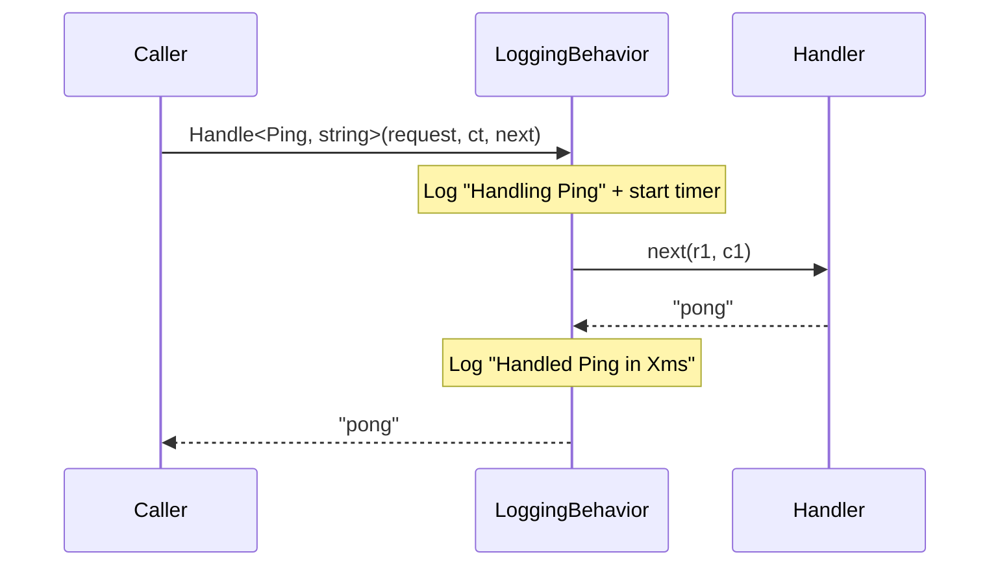

# Cookbook: Logging Behavior

Add structured request/response logging to every pipeline call without modifying a single handler.

## What We're Building

- A `LoggingBehavior` that logs the request type and elapsed time for every call
- Works with any ZeroAlloc.Mediator request type
- Zero allocation for the logging behavior wrapper itself

## Implementation

```csharp
using ZeroAlloc.Pipeline;
using Microsoft.Extensions.Logging;
using System.Diagnostics;

[PipelineBehavior(Order = 1)]
public class LoggingBehavior : IPipelineBehavior
{
    // ILogger is injected via DI — stored as a static field populated at startup
    private static ILogger<LoggingBehavior>? _logger;

    public static void Configure(ILogger<LoggingBehavior> logger) => _logger = logger;

    public static async ValueTask<TResponse> Handle<TRequest, TResponse>(
        TRequest request,
        CancellationToken ct,
        Func<TRequest, CancellationToken, ValueTask<TResponse>> next)
    {
        var sw = Stopwatch.StartNew();
        _logger?.LogInformation("Handling {RequestType}", typeof(TRequest).Name);

        var result = await next(request, ct);

        _logger?.LogInformation("Handled {RequestType} in {ElapsedMs}ms",
            typeof(TRequest).Name, sw.ElapsedMilliseconds);

        return result;
    }
}
```

## DI Registration

```csharp
// In your startup / DI setup
builder.Services.AddHostedService<LoggingBehaviorConfigurator>();

public class LoggingBehaviorConfigurator(ILogger<LoggingBehavior> logger) : IHostedService
{
    public Task StartAsync(CancellationToken ct) { LoggingBehavior.Configure(logger); return Task.CompletedTask; }
    public Task StopAsync(CancellationToken ct)  => Task.CompletedTask;
}
```

## Architecture Diagram



## Related

- [Pipeline Behaviors](../pipeline-behaviors.md) — full attribute reference
- [Cookbook: Ordered Behavior Chain](03-ordered-behavior-chain.md) — composing multiple behaviors
