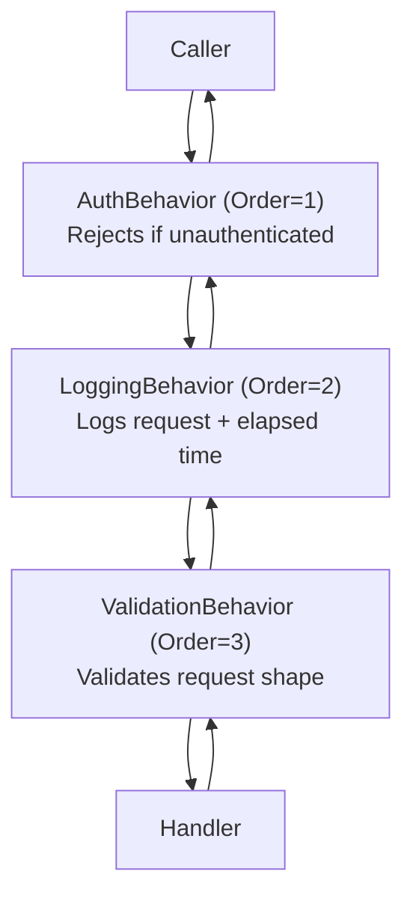

# Cookbook: Ordered Behavior Chain

Compose authentication, logging, and validation behaviors in a deterministic order using `Order`.

## What We're Building

- Three behaviors: `AuthBehavior` (Order=1), `LoggingBehavior` (Order=2), `ValidationBehavior` (Order=3)
- Auth runs outermost — rejects unauthenticated requests before logging or validation
- Logging wraps validation — captures the full elapsed time including validation

## Implementation

```csharp
using ZeroAlloc.Pipeline;

[PipelineBehavior(Order = 1)]
public class AuthBehavior : IPipelineBehavior
{
    public static async ValueTask<TResponse> Handle<TRequest, TResponse>(
        TRequest request,
        CancellationToken ct,
        Func<TRequest, CancellationToken, ValueTask<TResponse>> next)
    {
        if (!CurrentUser.IsAuthenticated)
            throw new UnauthorizedAccessException();
        return await next(request, ct);
    }
}

[PipelineBehavior(Order = 2)]
public class LoggingBehavior : IPipelineBehavior
{
    public static async ValueTask<TResponse> Handle<TRequest, TResponse>(
        TRequest request,
        CancellationToken ct,
        Func<TRequest, CancellationToken, ValueTask<TResponse>> next)
    {
        Console.WriteLine($"→ {typeof(TRequest).Name}");
        var result = await next(request, ct);
        Console.WriteLine($"← {typeof(TRequest).Name}");
        return result;
    }
}

[PipelineBehavior(Order = 3)]
public class ValidationBehavior : IPipelineBehavior
{
    public static async ValueTask<TResponse> Handle<TRequest, TResponse>(
        TRequest request,
        CancellationToken ct,
        Func<TRequest, CancellationToken, ValueTask<TResponse>> next)
        where TRequest : IValidatable
    {
        request.Validate(); // throws on failure
        return await next(request, ct);
    }
}
```

## Architecture Diagram



## Related

- [Pipeline Behaviors](../pipeline-behaviors.md) — Order and duplicate order rules
- [Diagnostics](../diagnostics.md) — ZAP002 duplicate Order warning
