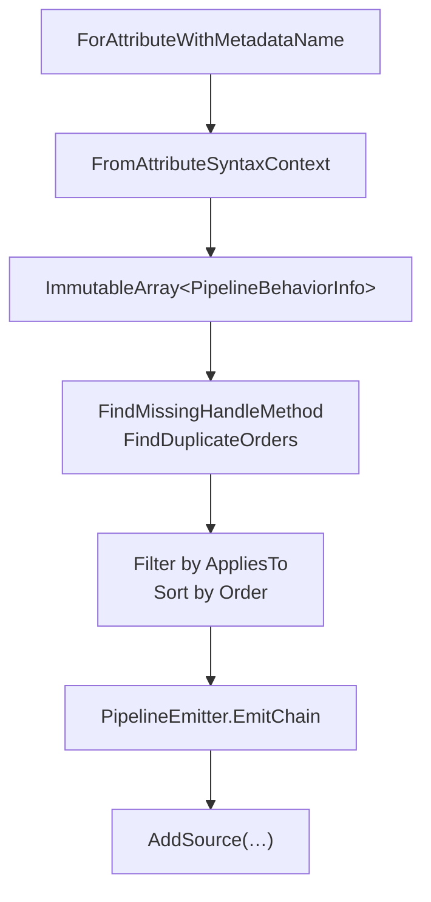

# Cookbook: Build a Pipeline Generator

Wire `PipelineBehaviorDiscoverer`, `PipelineShape`, and `PipelineEmitter` together inside an `IIncrementalGenerator`.

## What We're Building

- An incremental source generator that:
  1. Discovers all `[PipelineBehavior]` classes in the compilation
  2. Groups them by pipeline type
  3. Emits a static `Send<TRequest, TResponse>` method for each request type

## Project Setup

```bash
dotnet add package ZeroAlloc.Pipeline
dotnet add package ZeroAlloc.Pipeline.Generators
dotnet add package Microsoft.CodeAnalysis.CSharp
```

## The Generator

```csharp
using Microsoft.CodeAnalysis;
using ZeroAlloc.Pipeline.Generators;

[Generator]
public class MyPipelineGenerator : IIncrementalGenerator
{
    public void Initialize(IncrementalGeneratorInitializationContext context)
    {
        // 1. Collect all behavior info using the incremental API
        var behaviors = context.SyntaxProvider
            .ForAttributeWithMetadataName(
                "ZeroAlloc.Pipeline.PipelineBehaviorAttribute",
                predicate: static (node, _) => node is ClassDeclarationSyntax,
                transform: static (ctx, _) => PipelineBehaviorDiscoverer.FromAttributeSyntaxContext(ctx))
            .Where(static info => info != null)
            .Select(static (info, _) => info!)
            .Collect();

        // 2. Combine with compilation to get request types
        var combined = behaviors.Combine(context.CompilationProvider);

        context.RegisterSourceOutput(combined, static (spc, source) =>
        {
            var (allBehaviors, compilation) = source;
            EmitDispatcher(spc, allBehaviors, compilation);
        });
    }

    private static void EmitDispatcher(
        SourceProductionContext spc,
        ImmutableArray<PipelineBehaviorInfo> allBehaviors,
        Compilation compilation)
    {
        // 3. Validate
        var invalid = PipelineDiagnosticRules
            .FindMissingHandleMethod(allBehaviors, expectedTypeParamCount: 2);
        foreach (var b in invalid)
            spc.ReportDiagnostic(Diagnostic.Create(MissingHandleDescriptor, Location.None, b.BehaviorTypeName));

        var dupes = PipelineDiagnosticRules.FindDuplicateOrders(allBehaviors);
        foreach (var group in dupes)
            foreach (var b in group)
                spc.ReportDiagnostic(Diagnostic.Create(DuplicateOrderDescriptor, Location.None, b.Order));

        // 4. For each request type, build and emit a chain
        foreach (var requestType in GetRequestTypes(compilation))
        {
            var applicable = allBehaviors
                .Where(b => b.AppliesTo == null || b.AppliesTo == requestType.Fqn)
                .OrderBy(b => b.Order)
                .ToList();

            var shape = new PipelineShape
            {
                TypeArguments           = [requestType.Fqn, requestType.ResponseFqn],
                OuterParameterNames     = ["request", "ct"],
                LambdaParameterPrefixes = ["r", "c"],
                InnermostBodyFactory    = depth =>
                    $"{{ var h = new {requestType.HandlerFqn}(); return h.Handle(r{depth}, c{depth}); }}",
            };

            string chain = PipelineEmitter.EmitChain(applicable, shape);

            spc.AddSource($"Dispatcher.{requestType.Name}.g.cs", $$"""
                // <auto-generated/>
                public static partial class Dispatcher
                {
                    public static System.Threading.Tasks.ValueTask<{{requestType.ResponseFqn}}> Send(
                        {{requestType.Fqn}} request, System.Threading.CancellationToken ct = default)
                        => {{chain}};
                }
                """);
        }
    }
}
```

## Architecture Diagram



## Related

- [Pipeline Discoverer](../pipeline-discoverer.md) — `FromAttributeSyntaxContext` reference
- [Pipeline Emitter](../pipeline-emitter.md) — `EmitChain` reference
- [Cookbook: Custom Diagnostic Rules](05-custom-diagnostic-rules.md)
