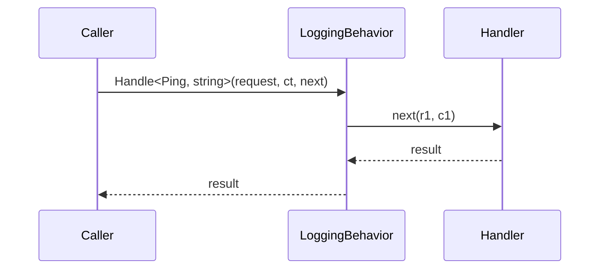

# Getting Started

ZeroAlloc.Pipeline provides the shared contracts and tools that pipeline-aware source generators build on. If you are using ZeroAlloc.Mediator or ZeroAlloc.Validation, you are already using this library indirectly. This guide shows you how behaviors work from the ground up.

## Installation

```bash
dotnet add package ZeroAlloc.Pipeline
dotnet add package ZeroAlloc.Pipeline.Generators
```

```xml
<PackageReference Include="ZeroAlloc.Pipeline" Version="*" />
<PackageReference Include="ZeroAlloc.Pipeline.Generators" Version="*"
                  OutputItemType="Analyzer"
                  ReferenceOutputAssembly="false" />
```

## Your First Behavior

### Step 1 — Implement `IPipelineBehavior`

`IPipelineBehavior` is a marker interface. It has no members — it tells the generator that your class participates in the pipeline.

```csharp
using ZeroAlloc.Pipeline;

public class LoggingBehavior : IPipelineBehavior
{
}
```

### Step 2 — Decorate with `[PipelineBehavior]`

```csharp
[PipelineBehavior(Order = 1)]
public class LoggingBehavior : IPipelineBehavior
{
}
```

`Order = 1` means this behavior runs first (outermost). Lower values wrap outer, higher values wrap inner.

### Step 3 — Add a static `Handle` method

The `Handle` method signature must match the delegate shape defined by the host framework (e.g. ZeroAlloc.Mediator). The method must be `public static`.

```csharp
[PipelineBehavior(Order = 1)]
public class LoggingBehavior : IPipelineBehavior
{
    public static async ValueTask<TResponse> Handle<TRequest, TResponse>(
        TRequest request,
        CancellationToken ct,
        Func<TRequest, CancellationToken, ValueTask<TResponse>> next)
    {
        Console.WriteLine($"→ {typeof(TRequest).Name}");
        var result = await next(request, ct);
        Console.WriteLine($"← {typeof(TRequest).Name}");
        return result;
    }
}
```

### Step 4 — The generator wires it in

When you build your project, the host generator (e.g. ZeroAlloc.Mediator) discovers `LoggingBehavior` and generates the call chain automatically. No `services.AddTransient<LoggingBehavior>()` or manual registration needed.

## What Gets Generated

```csharp
// Conceptual — what the generator emits when one behavior is present
return global::App.LoggingBehavior.Handle<global::App.Ping, string>(
    request, ct,
    static (r1, c1) =>
        { var h = new PingHandler(); return h.Handle(r1, c1); });
```

The call chain is a nested set of static lambda expressions. No allocation occurs during dispatch.

## Architecture Overview



## Key Concepts

- **`IPipelineBehavior`** — marker interface; the generator discovers any class that implements it and carries `[PipelineBehavior]`
- **`[PipelineBehavior]`** — controls `Order` (execution position) and `AppliesTo` (type scoping)
- **`Handle` method** — must be `public static`; signature is dictated by the host framework
- **Compile-time wiring** — no runtime registration; the generator emits a static call chain at build time

## Next Steps

| Guide | What you'll learn |
|-------|-------------------|
| [Pipeline Behaviors](pipeline-behaviors.md) | Full attribute reference, ordering, scoping |
| [Pipeline Emitter](pipeline-emitter.md) | How the nested call chain is built |
| [Pipeline Discoverer](pipeline-discoverer.md) | How the generator finds your behaviors |
| [Cookbook: Logging Behavior](cookbook/01-logging-behavior.md) | End-to-end logging behavior recipe |
