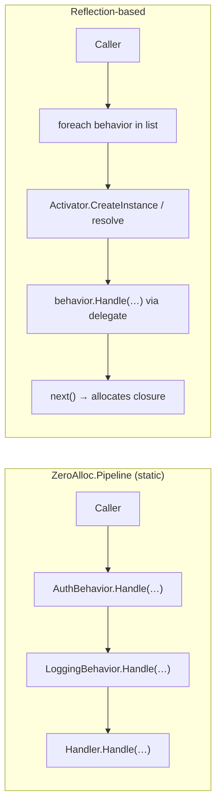

# Performance

ZeroAlloc.Pipeline emits static nested lambda call chains at compile time. No heap allocation occurs during pipeline dispatch itself.

## Why Reflection-Based Pipelines Allocate

A typical runtime-resolved pipeline (e.g. a `List<IPipelineBehavior>` iterated with a recursive delegate) allocates on every call because:

- A delegate object is created to represent `next` at each nesting level
- The behavior list is stored as a managed array or dictionary
- Virtual dispatch on the interface method boxes value types and prevents inlining

## How ZeroAlloc.Pipeline Eliminates Allocation

### Static lambda chains

The generator emits a tree of static lambdas at build time. Static lambdas are guaranteed not to capture any state, so the runtime never needs to allocate a closure object for them.

```csharp
// Conceptual — what the generator emits for two behaviors
return global::App.AuthBehavior.Handle<global::App.Ping, string>(
    request, ct,
    static (r1, c1) =>
        global::App.LoggingBehavior.Handle<global::App.Ping, string>(
            r1, c1,
            static (r2, c2) =>
                { var h = new PingHandler(); return h.Handle(r2, c2); }));
```

### No dictionary lookup

Behaviors are resolved by the generator — the compiled output contains direct `TypeName.Handle(...)` calls. There is no runtime lookup or switch.

### No virtual dispatch

`Handle` is called as a static method. The JIT inlines it freely without a virtual dispatch stub.

## Benchmark Results

BenchmarkDotNet v0.15.8, Windows 11, 12th Gen Intel Core i9-12900HK 2.50 GHz, .NET 10.0.4 — [`tests/ZeroAlloc.Pipeline.Benchmarks`](../tests/ZeroAlloc.Pipeline.Benchmarks).

The comparison is **static chain** (what `PipelineEmitter.EmitChain` generates) vs a **pre-built delegate chain** (interface-based pipeline with chain allocated once at startup, not per call — the best achievable runtime alternative).

| Method | Categories | Mean | Ratio | Allocated |
|--------|------------|-----:|------:|----------:|
| Static chain | 0 behaviors | 0.06 ns | — | 0 B |
| Pre-built delegate chain | 0 behaviors | 1.04 ns | — | 0 B |
| | | | | |
| Static chain | 1 behavior | 4.11 ns | 1.00 | 0 B |
| Pre-built delegate chain | 1 behavior | 2.16 ns | 0.53 | 0 B |
| | | | | |
| Static chain | 3 behaviors | 2.33 ns | 1.00 | 0 B |
| Pre-built delegate chain | 3 behaviors | 9.93 ns | 4.25 | 0 B |
| | | | | |
| Static chain | 5 behaviors | 2.76 ns | 1.00 | 0 B |
| Pre-built delegate chain | 5 behaviors | 17.62 ns | 6.38 | 0 B |

**Key observations:**
- Both approaches allocate **0 B** per call when the delegate chain is pre-built.
- For 1 behavior, the pre-built delegate is ~2× faster — the JIT pays a small generic specialization cost on the single-level static chain.
- For 3+ behaviors, the static chain wins decisively (4–6×) because the JIT inlines static calls transitively, collapsing the entire chain into straight-line code. Delegate dispatch cannot inline across virtual call sites.

## Static vs Reflection Dispatch



## Native AOT

ZeroAlloc.Pipeline is fully AOT-safe. Because all dispatch is static and resolved at compile time, there is nothing for the trimmer to remove and no reflection paths that need `[DynamicallyAccessedMembers]`.

```xml
<!-- No special configuration required -->
<PublishSingleFile>true</PublishSingleFile>
<PublishTrimmed>true</PublishTrimmed>
```

## When Zero Allocation Matters

**It matters for:**
- High-throughput services handling thousands of requests per second
- Hot paths in games, parsers, or real-time systems
- Services with strict GC pause budgets
- Applications targeting Native AOT

**It probably doesn't matter for:**
- CRUD endpoints doing database I/O (allocation is not the bottleneck)
- Background jobs that run infrequently
- Applications already dominated by third-party library allocations

## Tips for Maximum Performance

1. Keep `Handle` methods lean — expensive logic in a behavior negates the allocation win
2. Avoid capturing variables in `InnermostBodyTemplate` / `InnermostBodyFactory` — static lambdas must be capture-free
3. Use `FromAttributeSyntaxContext` in generators — reduces IDE latency during development
4. Sort behaviors by `Order` once (at generation time), not at runtime
