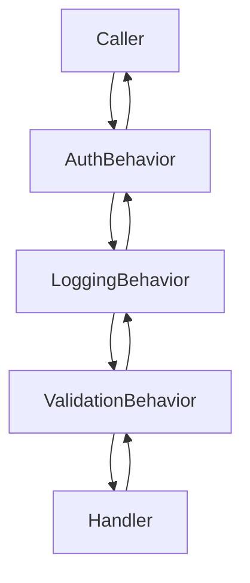

# Pipeline Behaviors

A pipeline behavior is a class that wraps the execution of a request or model through a series of cross-cutting steps. ZeroAlloc.Pipeline discovers behaviors at compile time and wires them into a static nested call chain — no reflection, no allocation.

## `IPipelineBehavior`

`IPipelineBehavior` is a marker interface with no members. Every behavior class must implement it.

```csharp
using ZeroAlloc.Pipeline;

[PipelineBehavior(Order = 1)]
public class MyBehavior : IPipelineBehavior
{
    // ...
}
```

The generator uses `IPipelineBehavior` as one of two required signals. The other is `[PipelineBehaviorAttribute]`.

## `PipelineBehaviorAttribute`

```csharp
[AttributeUsage(AttributeTargets.Class, Inherited = false)]
public class PipelineBehaviorAttribute(int order = 0) : Attribute
{
    public int Order { get; set; }
    public Type? AppliesTo { get; set; }
}
```

### `Order`

Controls where in the chain the behavior runs. Lower values execute first (outermost wrapper).

```csharp
[PipelineBehavior(Order = 1)] public class AuthBehavior       : IPipelineBehavior { ... }
[PipelineBehavior(Order = 2)] public class LoggingBehavior    : IPipelineBehavior { ... }
[PipelineBehavior(Order = 3)] public class ValidationBehavior : IPipelineBehavior { ... }
```



### `AppliesTo`

Restricts the behavior to a single request or model type. When `null`, the behavior applies to every type in the pipeline.

```csharp
// Applies to all types
[PipelineBehavior(Order = 1)]
public class LoggingBehavior : IPipelineBehavior { ... }

// Applies only to CreateOrderCommand
[PipelineBehavior(Order = 2, AppliesTo = typeof(CreateOrderCommand))]
public class OrderValidationBehavior : IPipelineBehavior { ... }
```

`AppliesTo` is read by the generator at compile time via the Roslyn symbol model. It is never accessed via reflection at runtime.

## Subclassing the Attribute

Framework-specific packages subclass `PipelineBehaviorAttribute` to provide a namespace-local alias. The discoverer follows the inheritance chain, so subclass attributes are detected automatically.

```csharp
// In ZeroAlloc.Mediator (example)
public sealed class MediatorPipelineBehaviorAttribute : PipelineBehaviorAttribute
{
    public MediatorPipelineBehaviorAttribute(int order = 0) : base(order) { }
}

// In your app — uses the framework alias, not the base attribute
[MediatorPipelineBehavior(Order = 1)]
public class LoggingBehavior : IPipelineBehavior { ... }
```

## The `Handle` Method

The method must be `public static` and its signature must match the delegate shape defined by the host framework.

```csharp
// ZeroAlloc.Mediator shape (2 type params)
public static ValueTask<TResponse> Handle<TRequest, TResponse>(
    TRequest request,
    CancellationToken ct,
    Func<TRequest, CancellationToken, ValueTask<TResponse>> next)
    => next(request, ct);

// ZeroAlloc.Validation shape (1 type param)
public static ValidationResult Handle<T>(
    T instance,
    Func<T, ValidationResult> next)
    => next(instance);
```

## Rules & Best Practices

- Always implement both `IPipelineBehavior` **and** carry `[PipelineBehaviorAttribute]` — either alone is not enough
- `Order` values must be unique within a pipeline — duplicate orders produce a `ZAP002` warning
- `Handle` must be `public static` — instance methods are ignored
- Type parameters on `Handle` must match the host framework's expected count — mismatches produce `ZAP001`
- Prefer the framework-specific attribute alias (e.g. `[MediatorPipelineBehavior]`) over the base `[PipelineBehavior]` when one exists

## Common Pitfalls

**Pitfall 1 — Non-static Handle**

```csharp
// ❌ Instance method is not picked up by the generator
[PipelineBehavior(Order = 1)]
public class MyBehavior : IPipelineBehavior
{
    public ValueTask<TResponse> Handle<TRequest, TResponse>(...) => ...;
}

// ✅ Must be static
[PipelineBehavior(Order = 1)]
public class MyBehavior : IPipelineBehavior
{
    public static ValueTask<TResponse> Handle<TRequest, TResponse>(...) => ...;
}
```

**Pitfall 2 — Missing `IPipelineBehavior`**

```csharp
// ❌ Attribute without interface — not discovered
[PipelineBehavior(Order = 1)]
public class MyBehavior
{
    public static ValueTask<TResponse> Handle<TRequest, TResponse>(...) => ...;
}

// ✅ Both required
[PipelineBehavior(Order = 1)]
public class MyBehavior : IPipelineBehavior
{
    public static ValueTask<TResponse> Handle<TRequest, TResponse>(...) => ...;
}
```

**Pitfall 3 — Duplicate Order values**

```csharp
// ❌ ZAP002: duplicate Order = 1
[PipelineBehavior(Order = 1)] public class AuthBehavior    : IPipelineBehavior { ... }
[PipelineBehavior(Order = 1)] public class LoggingBehavior : IPipelineBehavior { ... }

// ✅ Each behavior has a unique Order
[PipelineBehavior(Order = 1)] public class AuthBehavior    : IPipelineBehavior { ... }
[PipelineBehavior(Order = 2)] public class LoggingBehavior : IPipelineBehavior { ... }
```

See [Diagnostics](diagnostics.md) for the full diagnostic reference.
