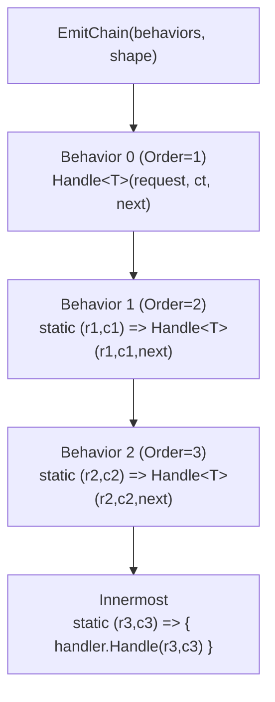

# Pipeline Emitter

`PipelineEmitter.EmitChain` takes a pre-filtered, pre-sorted list of behaviors and a `PipelineShape` and returns the C# source string for the nested static lambda call chain. Paste the result after `return ` in your generated method body.

## Signature

```csharp
public static string EmitChain(
    IReadOnlyList<PipelineBehaviorInfo> behaviors,
    PipelineShape shape)
```

`behaviors` must be:
1. Already filtered by `AppliesTo` for the request type being generated
2. Already sorted by `Order` ascending
3. Non-null (throws `ArgumentNullException`)

`shape` must have all three `required` properties set and a non-empty body source (throws `ArgumentException` if not).

## Example

**Input:**

```csharp
var behaviors = new[]
{
    new PipelineBehaviorInfo("global::App.AuthBehavior",       order: 1, appliesTo: null, typeParamCount: 2),
    new PipelineBehaviorInfo("global::App.LoggingBehavior",    order: 2, appliesTo: null, typeParamCount: 2),
    new PipelineBehaviorInfo("global::App.ValidationBehavior", order: 3, appliesTo: null, typeParamCount: 2),
};

var shape = new PipelineShape
{
    TypeArguments           = ["global::App.Ping", "string"],
    OuterParameterNames     = ["request", "ct"],
    LambdaParameterPrefixes = ["r", "c"],
    InnermostBodyFactory    = depth =>
        $"{{ var h = new PingHandler(); return h.Handle(r{depth}, c{depth}); }}",
};

string chain = PipelineEmitter.EmitChain(behaviors, shape);
```

**Output:**

```csharp
// Conceptual — what the generator emits for the chain above
global::App.AuthBehavior.Handle<global::App.Ping, string>(
    request, ct,
    static (r1, c1) =>
        global::App.LoggingBehavior.Handle<global::App.Ping, string>(
            r1, c1,
            static (r2, c2) =>
                global::App.ValidationBehavior.Handle<global::App.Ping, string>(
                    r2, c2,
                    static (r3, c3) =>
                        { var h = new PingHandler(); return h.Handle(r3, c3); })))
```

## Nesting Depth

Each behavior adds one nesting level. The lambda parameter names increment with the depth so inner lambdas never shadow outer ones.



## Zero Behaviors

When `behaviors` is empty, `EmitChain` returns the innermost body directly — no wrapping lambda.

```csharp
var result = PipelineEmitter.EmitChain([], shape);
// Returns: "{ var h = new PingHandler(); return h.Handle(r0, c0); }"
```

## Rules & Best Practices

- Sort by `Order` **before** calling `EmitChain` — the emitter does not sort
- Filter by `AppliesTo` **before** calling `EmitChain`
- Use `InnermostBodyFactory` (not `InnermostBodyTemplate`) unless the body truly has no depth-dependent parameter names
- Place the result after `return ` in the generated method, not as a statement

## Common Pitfalls

**Pitfall 1 — Unsorted behaviors**

```csharp
// ❌ Behaviors passed in arbitrary order — chain runs in wrong sequence
var behaviors = GetBehaviors(); // unsorted

// ✅ Sort ascending by Order before emitting
var behaviors = GetBehaviors().OrderBy(b => b.Order).ToList();
string chain  = PipelineEmitter.EmitChain(behaviors, shape);
```

**Pitfall 2 — Not filtering by AppliesTo**

```csharp
// ❌ Scoped behaviors applied to every request type
var behaviors = allBehaviors;

// ✅ Filter: include global behaviors + those scoped to this specific type
var behaviors = allBehaviors
    .Where(b => b.AppliesTo == null || b.AppliesTo == requestTypeFqn)
    .OrderBy(b => b.Order)
    .ToList();
```
