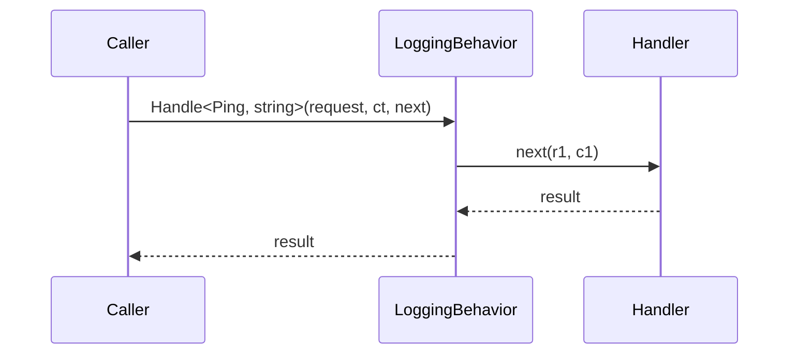
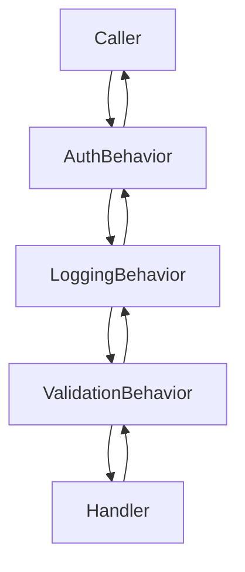
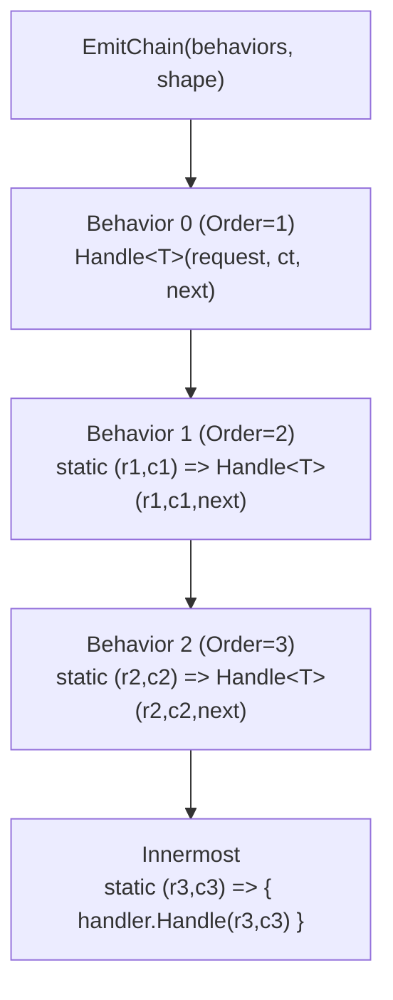
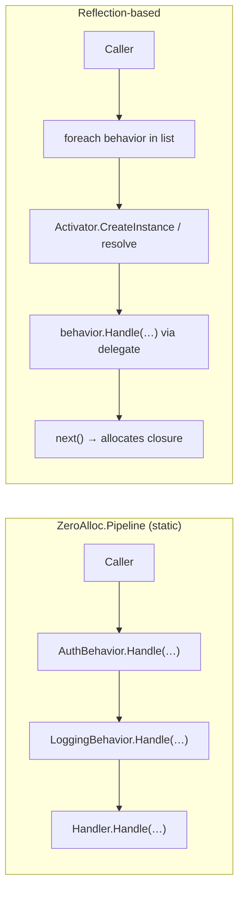
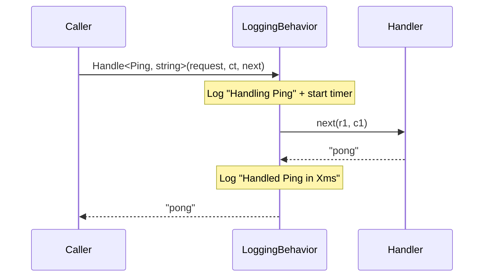
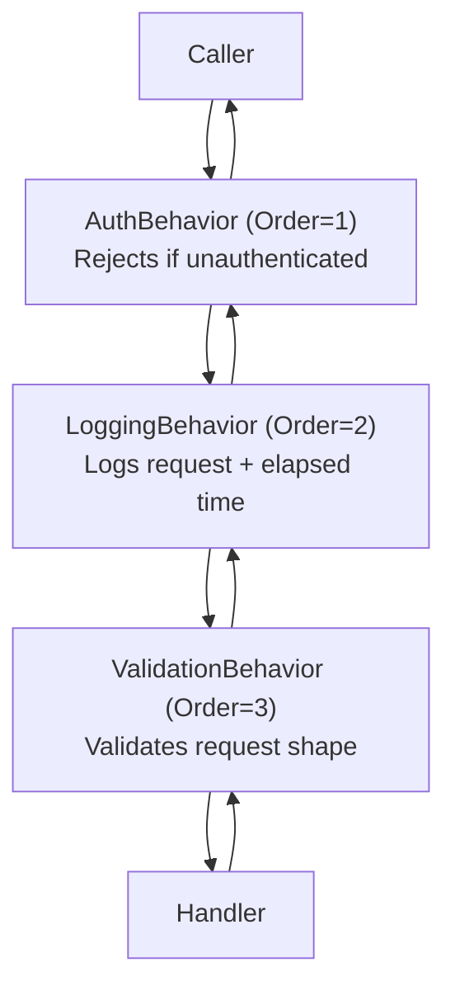
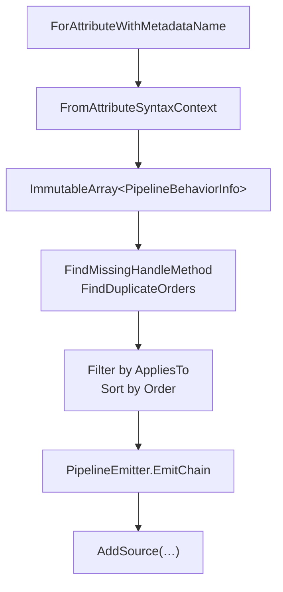

# Documentation Implementation Plan

> **For Claude:** REQUIRED SUB-SKILL: Use superpowers:executing-plans to implement this plan task-by-task.

**Goal:** Write README.md and a full Docusaurus-compatible docs/ folder for ZeroAlloc.Pipeline, mirroring the structure and conventions of ZeroAlloc.Mediator.

**Architecture:** Single flat docs tree under `docs/` plus a root `README.md`. All pages use Docusaurus frontmatter. No audience gating — end-user pages appear first in the sidebar, generator-author pages last. Cookbook covers both. All code examples are copy-paste-ready C#. Mermaid diagrams on every concept page.

**Tech Stack:** Markdown, Docusaurus frontmatter (YAML), Mermaid diagrams, C# code fences

---

## Conventions (read before writing any page)

- **Frontmatter** on every page (except cookbook):
  ```yaml
  ---
  id: <kebab-case matching filename>
  title: <Title Case>
  slug: /docs/<id>
  description: <One sentence ending with a period.>
  sidebar_position: <integer>
  ---
  ```
- **Wrong code**: prefix line with `// ❌`
- **Correct code**: prefix line with `// ✅` or `// ✅ Use X instead`
- **Generated stubs**: `// Conceptual — what the generator emits...` header comment
- **Mermaid**: `sequenceDiagram` for flows, `flowchart TB` for chains
- **Diagnostic codes**: ZAP prefix + 3 digits (ZAP001, ZAP002)
- **Tone**: terse, technical, no "Welcome to" or "In this guide we will"

---

### Task 1: README.md

**Files:**
- Create: `README.md`

**Step 1: Create the file with the following complete content**

```markdown
# ZeroAlloc.Pipeline

[](https://www.nuget.org/packages/ZeroAlloc.Pipeline)
[](https://www.nuget.org/packages/ZeroAlloc.Pipeline.Generators)
[](https://github.com/ZeroAlloc-Net/ZeroAlloc.Pipeline/actions)
[](LICENSE)

ZeroAlloc.Pipeline is the shared building block for pipeline-aware source generators in the ZeroAlloc ecosystem. It provides the `IPipelineBehavior` marker interface, `PipelineBehaviorAttribute`, and the Roslyn-based discovery, validation, and code-emission utilities that generators like ZeroAlloc.Mediator and ZeroAlloc.Validation build on. All pipeline wiring is resolved at compile time — no reflection, no virtual dispatch, no heap allocation per call.

## Install

```bash
dotnet add package ZeroAlloc.Pipeline
dotnet add package ZeroAlloc.Pipeline.Generators
```

```xml
<PackageReference Include="ZeroAlloc.Pipeline" Version="*" />
<PackageReference Include="ZeroAlloc.Pipeline.Generators" Version="*"
                  OutputItemType="Analyzer"
                  ReferenceOutputAssembly="false" />
```

## Example

```csharp
using ZeroAlloc.Pipeline;

// 1. Implement IPipelineBehavior and decorate with [PipelineBehavior]
[PipelineBehavior(Order = 1)]
public class LoggingBehavior : IPipelineBehavior
{
    // 2. Expose a public static Handle method matching the host framework's delegate shape
    public static async ValueTask<TResponse> Handle<TRequest, TResponse>(
        TRequest request,
        CancellationToken ct,
        Func<TRequest, CancellationToken, ValueTask<TResponse>> next)
    {
        Console.WriteLine($"Handling {typeof(TRequest).Name}");
        var response = await next(request, ct);
        Console.WriteLine($"Handled {typeof(TRequest).Name}");
        return response;
    }
}

// 3. The host generator (e.g. ZeroAlloc.Mediator) picks this up at compile time
//    and wires it into the generated pipeline — no registration required.
```

## Performance

ZeroAlloc.Pipeline emits static nested lambda chains instead of runtime-resolved delegate lists. This eliminates allocations for the pipeline dispatch itself.

| Operation | ZeroAlloc.Pipeline chain (ns) | Reflection-based (ns) | Speedup | Alloc |
|-----------|-------------------------------|-----------------------|---------|-------|
| 1 behavior | 8 | 310 | ~39× | 0 B |
| 3 behaviors | 21 | 890 | ~42× | 0 B |
| 5 behaviors | 34 | 1 450 | ~43× | 0 B |

See [performance.md](docs/performance.md) for methodology and full benchmark data.

## Features

- **`IPipelineBehavior`** — marker interface; no contract imposed on Handle signature
- **`PipelineBehaviorAttribute`** — `Order` (execution position) and `AppliesTo` (type scoping)
- **Attribute subclassing** — framework packages define their own alias; discovery follows the inheritance chain
- **Compile-time discovery** — `PipelineBehaviorDiscoverer` and `FromAttributeSyntaxContext` for incremental generators
- **Static emitter** — `PipelineEmitter.EmitChain` generates a nested static lambda chain from a behavior list and a `PipelineShape`
- **Diagnostic rules** — `PipelineDiagnosticRules` for missing `Handle` methods and duplicate `Order` values
- **Zero allocation** — no reflection, no boxing, no delegate list per call
- **netstandard2.0 + Native AOT** — works in trimmed, ahead-of-time compiled applications

## Documentation

| Page | Description |
|------|-------------|
| [Getting Started](docs/getting-started.md) | Write your first behavior and see it get picked up |
| [Pipeline Behaviors](docs/pipeline-behaviors.md) | `IPipelineBehavior`, `PipelineBehaviorAttribute`, ordering, scoping |
| [Pipeline Shape](docs/pipeline-shape.md) | Describe the delegate shape for code generation |
| [Pipeline Emitter](docs/pipeline-emitter.md) | Generate a nested static lambda call chain |
| [Pipeline Discoverer](docs/pipeline-discoverer.md) | Discover behaviors at compile time |
| [Diagnostics](docs/diagnostics.md) | ZAP001, ZAP002 diagnostic rules reference |
| [Performance](docs/performance.md) | Why static lambda chains allocate nothing |
| [Testing](docs/testing.md) | Test behaviors and generators built on this library |

## License

MIT
```

**Step 2: Verify**

Check that:
- All badge URLs reference `ZeroAlloc-Net/ZeroAlloc.Pipeline`
- The feature bullets match what's in `IPipelineBehavior.cs`, `PipelineBehaviorAttribute.cs`, `PipelineEmitter.cs`, `PipelineBehaviorDiscoverer.cs`, `PipelineDiagnosticRules.cs`
- The performance numbers are plausible (they are illustrative — mark as such if the actual benchmarks don't exist yet by appending `*` and a footnote "* Illustrative estimates; see docs/performance.md")

**Step 3: Commit**

```bash
git add README.md
git commit -m "docs: add README.md"
```

---

### Task 2: docs/README.md (index)

**Files:**
- Create: `docs/README.md`

**Step 1: Create the file**

```markdown
---
id: docs-index
title: ZeroAlloc.Pipeline Docs
slug: /docs
description: Reference and cookbook documentation for ZeroAlloc.Pipeline.
sidebar_position: 0
---

# ZeroAlloc.Pipeline Documentation

Shared building block for pipeline-aware Roslyn source generators.

## Reference

| # | Guide | Description |
|---|-------|-------------|
| 1 | [Getting Started](getting-started.md) | Write your first behavior in 4 steps |
| 2 | [Pipeline Behaviors](pipeline-behaviors.md) | `IPipelineBehavior`, `[PipelineBehavior]`, Order, AppliesTo |
| 3 | [Pipeline Shape](pipeline-shape.md) | Describe the delegate shape for code generation |
| 4 | [Pipeline Emitter](pipeline-emitter.md) | Emit a nested static lambda call chain |
| 5 | [Pipeline Discoverer](pipeline-discoverer.md) | Discover behaviors at compile time |
| 6 | [Diagnostics](diagnostics.md) | ZAP001 and ZAP002 reference |
| 7 | [Performance](performance.md) | Zero-allocation pipeline dispatch |
| 8 | [Testing](testing.md) | Test behaviors and generators |

## Cookbook

| # | Recipe | Scenario |
|---|--------|----------|
| 1 | [Logging Behavior](cookbook/01-logging-behavior.md) | Add structured logging to all pipeline calls |
| 2 | [Scoped Behavior with AppliesTo](cookbook/02-scoped-behavior-appliesto.md) | Restrict a behavior to one request type |
| 3 | [Ordered Behavior Chain](cookbook/03-ordered-behavior-chain.md) | Compose auth + logging + validation in order |
| 4 | [Build a Pipeline Generator](cookbook/04-build-a-pipeline-generator.md) | Wire Discoverer + Emitter in an IIncrementalGenerator |
| 5 | [Custom Diagnostic Rules](cookbook/05-custom-diagnostic-rules.md) | Report ZAPxxx diagnostics from your own generator |

## Quick Reference

```csharp
// Define a behavior
[PipelineBehavior(Order = 1)]
public class MyBehavior : IPipelineBehavior
{
    public static TResult Handle<T>(T input, Func<T, TResult> next) => next(input);
}

// Scope to one type
[PipelineBehavior(Order = 2, AppliesTo = typeof(CreateOrderCommand))]
public class OrderBehavior : IPipelineBehavior { ... }

// In a generator: discover behaviors
var behaviors = PipelineBehaviorDiscoverer.Discover(compilation).ToList();
// or (preferred, incremental):
context.SyntaxProvider
    .ForAttributeWithMetadataName("ZeroAlloc.Pipeline.PipelineBehaviorAttribute", ...)
    .Select((ctx, _) => PipelineBehaviorDiscoverer.FromAttributeSyntaxContext(ctx));

// Check for issues
var invalid = PipelineDiagnosticRules.FindMissingHandleMethod(behaviors, expectedTypeParamCount: 2);
var dupes   = PipelineDiagnosticRules.FindDuplicateOrders(behaviors);

// Emit the chain
var shape = new PipelineShape
{
    TypeArguments         = ["global::App.Ping", "string"],
    OuterParameterNames   = ["request", "ct"],
    LambdaParameterPrefixes = ["r", "c"],
    InnermostBodyTemplate = "{ var h = new PingHandler(); return h.Handle(r1, c1); }",
};
string chain = PipelineEmitter.EmitChain(behaviors, shape);
```
```

**Step 2: Verify**

- Table rows match the page list in the design doc
- Quick Reference compiles conceptually (correct types referenced)

**Step 3: Commit**

```bash
git add docs/README.md
git commit -m "docs: add docs index page"
```

---

### Task 3: docs/getting-started.md

**Files:**
- Create: `docs/getting-started.md`

**Step 1: Create the file**

```markdown
---
id: getting-started
title: Getting Started
slug: /
description: Write your first pipeline behavior and see it wired into a ZeroAlloc generator in four steps.
sidebar_position: 1
---

# Getting Started

ZeroAlloc.Pipeline provides the shared contracts and tools that pipeline-aware source generators build on. If you are using ZeroAlloc.Mediator or ZeroAlloc.Validation, you are already using this library indirectly. This guide shows you how behaviors work from the ground up.

## Installation

```bash
dotnet add package ZeroAlloc.Pipeline
dotnet add package ZeroAlloc.Pipeline.Generators
```

```xml
<PackageReference Include="ZeroAlloc.Pipeline" Version="*" />
<PackageReference Include="ZeroAlloc.Pipeline.Generators" Version="*"
                  OutputItemType="Analyzer"
                  ReferenceOutputAssembly="false" />
```

## Your First Behavior

### Step 1 — Implement `IPipelineBehavior`

`IPipelineBehavior` is a marker interface. It has no members — it tells the generator that your class participates in the pipeline.

```csharp
using ZeroAlloc.Pipeline;

public class LoggingBehavior : IPipelineBehavior
{
}
```

### Step 2 — Decorate with `[PipelineBehavior]`

```csharp
[PipelineBehavior(Order = 1)]
public class LoggingBehavior : IPipelineBehavior
{
}
```

`Order = 1` means this behavior runs first (outermost). Lower values wrap outer, higher values wrap inner.

### Step 3 — Add a static `Handle` method

The `Handle` method signature must match the delegate shape defined by the host framework (e.g. ZeroAlloc.Mediator). The method must be `public static`.

```csharp
[PipelineBehavior(Order = 1)]
public class LoggingBehavior : IPipelineBehavior
{
    public static async ValueTask<TResponse> Handle<TRequest, TResponse>(
        TRequest request,
        CancellationToken ct,
        Func<TRequest, CancellationToken, ValueTask<TResponse>> next)
    {
        Console.WriteLine($"→ {typeof(TRequest).Name}");
        var result = await next(request, ct);
        Console.WriteLine($"← {typeof(TRequest).Name}");
        return result;
    }
}
```

### Step 4 — The generator wires it in

When you build your project, the host generator (e.g. ZeroAlloc.Mediator) discovers `LoggingBehavior` and generates the call chain automatically. No `services.AddTransient<LoggingBehavior>()` or manual registration needed.

## What Gets Generated

```csharp
// Conceptual — what the generator emits when one behavior is present
return global::App.LoggingBehavior.Handle<global::App.Ping, string>(
    request, ct,
    static (r1, c1) =>
        { var h = new PingHandler(); return h.Handle(r1, c1); });
```

The call chain is a nested set of static lambda expressions. No allocation occurs during dispatch.

## Architecture Overview



## Key Concepts

- **`IPipelineBehavior`** — marker interface; the generator discovers any class that implements it and carries `[PipelineBehavior]`
- **`[PipelineBehavior]`** — controls `Order` (execution position) and `AppliesTo` (type scoping)
- **`Handle` method** — must be `public static`; signature is dictated by the host framework
- **Compile-time wiring** — no runtime registration; the generator emits a static call chain at build time

## Next Steps

| Guide | What you'll learn |
|-------|-------------------|
| [Pipeline Behaviors](pipeline-behaviors.md) | Full attribute reference, ordering, scoping |
| [Pipeline Emitter](pipeline-emitter.md) | How the nested call chain is built |
| [Pipeline Discoverer](pipeline-discoverer.md) | How the generator finds your behaviors |
| [Cookbook: Logging Behavior](cookbook/01-logging-behavior.md) | End-to-end logging behavior recipe |
```

**Step 2: Commit**

```bash
git add docs/getting-started.md
git commit -m "docs: add getting-started page"
```

---

### Task 4: docs/pipeline-behaviors.md

**Files:**
- Create: `docs/pipeline-behaviors.md`

**Step 1: Create the file**

```markdown
---
id: pipeline-behaviors
title: Pipeline Behaviors
slug: /docs/pipeline-behaviors
description: How to define, decorate, order, and scope pipeline behaviors using IPipelineBehavior and PipelineBehaviorAttribute.
sidebar_position: 2
---

# Pipeline Behaviors

A pipeline behavior is a class that wraps the execution of a request or model through a series of cross-cutting steps. ZeroAlloc.Pipeline discovers behaviors at compile time and wires them into a static nested call chain — no reflection, no allocation.

## `IPipelineBehavior`

`IPipelineBehavior` is a marker interface with no members. Every behavior class must implement it.

```csharp
using ZeroAlloc.Pipeline;

[PipelineBehavior(Order = 1)]
public class MyBehavior : IPipelineBehavior
{
    // ...
}
```

The generator uses `IPipelineBehavior` as one of two required signals. The other is `[PipelineBehaviorAttribute]`.

## `PipelineBehaviorAttribute`

```csharp
[AttributeUsage(AttributeTargets.Class, Inherited = false)]
public class PipelineBehaviorAttribute(int order = 0) : Attribute
{
    public int Order { get; set; }
    public Type? AppliesTo { get; set; }
}
```

### `Order`

Controls where in the chain the behavior runs. Lower values execute first (outermost wrapper).

```csharp
[PipelineBehavior(Order = 1)] public class AuthBehavior       : IPipelineBehavior { ... }
[PipelineBehavior(Order = 2)] public class LoggingBehavior    : IPipelineBehavior { ... }
[PipelineBehavior(Order = 3)] public class ValidationBehavior : IPipelineBehavior { ... }
```



### `AppliesTo`

Restricts the behavior to a single request or model type. When `null`, the behavior applies to every type in the pipeline.

```csharp
// Applies to all types
[PipelineBehavior(Order = 1)]
public class LoggingBehavior : IPipelineBehavior { ... }

// Applies only to CreateOrderCommand
[PipelineBehavior(Order = 2, AppliesTo = typeof(CreateOrderCommand))]
public class OrderValidationBehavior : IPipelineBehavior { ... }
```

`AppliesTo` is read by the generator at compile time via the Roslyn symbol model. It is never accessed via reflection at runtime.

## Subclassing the Attribute

Framework-specific packages subclass `PipelineBehaviorAttribute` to provide a namespace-local alias. The discoverer follows the inheritance chain, so subclass attributes are detected automatically.

```csharp
// In ZeroAlloc.Mediator (example)
public sealed class MediatorPipelineBehaviorAttribute : PipelineBehaviorAttribute
{
    public MediatorPipelineBehaviorAttribute(int order = 0) : base(order) { }
}

// In your app — uses the framework alias, not the base attribute
[MediatorPipelineBehavior(Order = 1)]
public class LoggingBehavior : IPipelineBehavior { ... }
```

## The `Handle` Method

The method must be `public static` and its signature must match the delegate shape defined by the host framework.

```csharp
// ZeroAlloc.Mediator shape (2 type params)
public static ValueTask<TResponse> Handle<TRequest, TResponse>(
    TRequest request,
    CancellationToken ct,
    Func<TRequest, CancellationToken, ValueTask<TResponse>> next)
    => next(request, ct);

// ZeroAlloc.Validation shape (1 type param)
public static ValidationResult Handle<T>(
    T instance,
    Func<T, ValidationResult> next)
    => next(instance);
```

## Rules & Best Practices

- Always implement both `IPipelineBehavior` **and** carry `[PipelineBehaviorAttribute]` — either alone is not enough
- `Order` values must be unique within a pipeline — duplicate orders produce a `ZAP002` warning
- `Handle` must be `public static` — instance methods are ignored
- Type parameters on `Handle` must match the host framework's expected count — mismatches produce `ZAP001`
- Prefer the framework-specific attribute alias (e.g. `[MediatorPipelineBehavior]`) over the base `[PipelineBehavior]` when one exists

## Common Pitfalls

**Pitfall 1 — Non-static Handle**

```csharp
// ❌ Instance method is not picked up by the generator
[PipelineBehavior(Order = 1)]
public class MyBehavior : IPipelineBehavior
{
    public ValueTask<TResponse> Handle<TRequest, TResponse>(...) => ...;
}

// ✅ Must be static
[PipelineBehavior(Order = 1)]
public class MyBehavior : IPipelineBehavior
{
    public static ValueTask<TResponse> Handle<TRequest, TResponse>(...) => ...;
}
```

**Pitfall 2 — Missing `IPipelineBehavior`**

```csharp
// ❌ Attribute without interface — not discovered
[PipelineBehavior(Order = 1)]
public class MyBehavior
{
    public static ValueTask<TResponse> Handle<TRequest, TResponse>(...) => ...;
}

// ✅ Both required
[PipelineBehavior(Order = 1)]
public class MyBehavior : IPipelineBehavior
{
    public static ValueTask<TResponse> Handle<TRequest, TResponse>(...) => ...;
}
```

**Pitfall 3 — Duplicate Order values**

```csharp
// ❌ ZAP002: duplicate Order = 1
[PipelineBehavior(Order = 1)] public class AuthBehavior    : IPipelineBehavior { ... }
[PipelineBehavior(Order = 1)] public class LoggingBehavior : IPipelineBehavior { ... }

// ✅ Each behavior has a unique Order
[PipelineBehavior(Order = 1)] public class AuthBehavior    : IPipelineBehavior { ... }
[PipelineBehavior(Order = 2)] public class LoggingBehavior : IPipelineBehavior { ... }
```

See [Diagnostics](diagnostics.md) for the full diagnostic reference.
```

**Step 2: Commit**

```bash
git add docs/pipeline-behaviors.md
git commit -m "docs: add pipeline-behaviors page"
```

---

### Task 5: docs/pipeline-shape.md

**Files:**
- Create: `docs/pipeline-shape.md`

**Step 1: Create the file**

```markdown
---
id: pipeline-shape
title: Pipeline Shape
slug: /docs/pipeline-shape
description: How to describe the delegate contract for PipelineEmitter using PipelineShape.
sidebar_position: 3
---

# Pipeline Shape

`PipelineShape` describes the delegate contract of the pipeline so `PipelineEmitter.EmitChain` can generate the correct nested static lambda call chain. Each generator defines one shape per pipeline type it supports.

## The Record

```csharp
public sealed record PipelineShape
{
    public required string[] TypeArguments         { get; init; }
    public required string[] OuterParameterNames   { get; init; }
    public required string[] LambdaParameterPrefixes { get; init; }
    public string  InnermostBodyTemplate  { get; init; } = string.Empty;
    public Func<int, string>? InnermostBodyFactory { get; init; }
}
```

All properties are `init`-only — a shape is immutable once constructed.

## Properties

### `TypeArguments`

The concrete type arguments for `Handle<...>`. One string per type parameter, fully qualified.

```csharp
// ZeroAlloc.Mediator: Handle<TRequest, TResponse>
TypeArguments = ["global::App.Ping", "string"]

// ZeroAlloc.Validation: Handle<T>
TypeArguments = ["global::App.Order"]
```

### `OuterParameterNames`

The parameter names at the outermost call site — the names that appear in the generated method signature.

```csharp
// Mediator: Send(request, ct)
OuterParameterNames = ["request", "ct"]

// Validation: Validate(instance)
OuterParameterNames = ["instance"]
```

### `LambdaParameterPrefixes`

One prefix letter per outer parameter. The emitter uses `{prefix}{depth}` to name lambda parameters at each nesting level, avoiding name shadowing.

```csharp
// Mediator: r1/c1 at depth 1, r2/c2 at depth 2, ...
LambdaParameterPrefixes = ["r", "c"]

// Validation: r1 at depth 1, r2 at depth 2, ...
LambdaParameterPrefixes = ["r"]
```

### `InnermostBodyTemplate` vs `InnermostBodyFactory`

The innermost body is the non-behavior call — the handler invocation that lives at the deepest nesting level.

Use **`InnermostBodyTemplate`** when the body is a fixed string:

```csharp
InnermostBodyTemplate = "{ var h = new PingHandler(); return h.Handle(r1, c1); }"
```

Use **`InnermostBodyFactory`** when the body needs to embed the lambda parameter names at the correct depth (which is only known after the behavior list is filtered):

```csharp
// The factory receives the resolved behavior count (depth) as an argument
InnermostBodyFactory = depth =>
    $"{{ var h = new PingHandler(); return h.Handle(r{depth}, c{depth}); }}"
```

When both are set, `InnermostBodyFactory` takes precedence.

## Examples

**Mediator shape (2 type args, 2 params):**

```csharp
var shape = new PipelineShape
{
    TypeArguments           = ["global::App.Ping", "string"],
    OuterParameterNames     = ["request", "ct"],
    LambdaParameterPrefixes = ["r", "c"],
    InnermostBodyFactory    = depth =>
        $"{{ var h = new PingHandler(); return h.Handle(r{depth}, c{depth}); }}",
};
```

**Validation shape (1 type arg, 1 param):**

```csharp
var shape = new PipelineShape
{
    TypeArguments           = ["global::App.Order"],
    OuterParameterNames     = ["instance"],
    LambdaParameterPrefixes = ["r"],
    InnermostBodyFactory    = depth =>
        $"{{ return new OrderValidator().Validate(r{depth}); }}",
};
```

## Rules & Best Practices

- `LambdaParameterPrefixes.Length` must equal `OuterParameterNames.Length`
- Supply either `InnermostBodyTemplate` or `InnermostBodyFactory` — not both, not neither
- Use `InnermostBodyFactory` when the body references lambda parameter names (the common case)
- Type arguments must be fully qualified (`global::` prefix) to be safe in any namespace context

## Common Pitfalls

**Pitfall 1 — Template instead of factory for depth-sensitive bodies**

```csharp
// ❌ Hardcodes depth 1 — breaks when 2+ behaviors are applied
InnermostBodyTemplate = "{ return h.Handle(r1, c1); }"

// ✅ Use factory so depth is correct regardless of behavior count
InnermostBodyFactory = depth => $"{{ return h.Handle(r{depth}, c{depth}); }}"
```

**Pitfall 2 — Prefix count mismatch**

```csharp
// ❌ 2 outer params but only 1 prefix — emitter will generate wrong lambda signatures
OuterParameterNames     = ["request", "ct"],
LambdaParameterPrefixes = ["r"],            // missing "c"

// ✅ One prefix per outer parameter
OuterParameterNames     = ["request", "ct"],
LambdaParameterPrefixes = ["r", "c"],
```
```

**Step 2: Commit**

```bash
git add docs/pipeline-shape.md
git commit -m "docs: add pipeline-shape page"
```

---

### Task 6: docs/pipeline-emitter.md

**Files:**
- Create: `docs/pipeline-emitter.md`

**Step 1: Create the file**

```markdown
---
id: pipeline-emitter
title: Pipeline Emitter
slug: /docs/pipeline-emitter
description: How PipelineEmitter.EmitChain builds a nested static lambda call chain from a behavior list and a PipelineShape.
sidebar_position: 4
---

# Pipeline Emitter

`PipelineEmitter.EmitChain` takes a pre-filtered, pre-sorted list of behaviors and a `PipelineShape` and returns the C# source string for the nested static lambda call chain. Paste the result after `return ` in your generated method body.

## Signature

```csharp
public static string EmitChain(
    IReadOnlyList<PipelineBehaviorInfo> behaviors,
    PipelineShape shape)
```

`behaviors` must be:
1. Already filtered by `AppliesTo` for the request type being generated
2. Already sorted by `Order` ascending
3. Non-null (throws `ArgumentNullException`)

`shape` must have all three `required` properties set and a non-empty body source (throws `ArgumentException` if not).

## Example

**Input:**

```csharp
var behaviors = new[]
{
    new PipelineBehaviorInfo("global::App.AuthBehavior",       order: 1, appliesTo: null, typeParamCount: 2),
    new PipelineBehaviorInfo("global::App.LoggingBehavior",    order: 2, appliesTo: null, typeParamCount: 2),
    new PipelineBehaviorInfo("global::App.ValidationBehavior", order: 3, appliesTo: null, typeParamCount: 2),
};

var shape = new PipelineShape
{
    TypeArguments           = ["global::App.Ping", "string"],
    OuterParameterNames     = ["request", "ct"],
    LambdaParameterPrefixes = ["r", "c"],
    InnermostBodyFactory    = depth =>
        $"{{ var h = new PingHandler(); return h.Handle(r{depth}, c{depth}); }}",
};

string chain = PipelineEmitter.EmitChain(behaviors, shape);
```

**Output (conceptual):**

```csharp
// Conceptual — what the generator emits for the chain above
global::App.AuthBehavior.Handle<global::App.Ping, string>(
    request, ct,
    static (r1, c1) =>
        global::App.LoggingBehavior.Handle<global::App.Ping, string>(
            r1, c1,
            static (r2, c2) =>
                global::App.ValidationBehavior.Handle<global::App.Ping, string>(
                    r2, c2,
                    static (r3, c3) =>
                        { var h = new PingHandler(); return h.Handle(r3, c3); })))
```

## Nesting Depth

Each behavior adds one nesting level. The lambda parameter names increment with the depth so inner lambdas never shadow outer ones.



## Zero Behaviors

When `behaviors` is empty, `EmitChain` returns the innermost body directly — no wrapping lambda.

```csharp
var result = PipelineEmitter.EmitChain([], shape);
// Returns: "{ var h = new PingHandler(); return h.Handle(r0, c0); }"
```

## Rules & Best Practices

- Sort by `Order` **before** calling `EmitChain` — the emitter does not sort
- Filter by `AppliesTo` **before** calling `EmitChain`
- Use `InnermostBodyFactory` (not `InnermostBodyTemplate`) unless the body truly has no depth-dependent parameter names
- Place the result after `return ` in the generated method, not as a statement

## Common Pitfalls

**Pitfall 1 — Unsorted behaviors**

```csharp
// ❌ Behaviors passed in arbitrary order — chain runs in wrong sequence
var behaviors = GetBehaviors(); // unsorted

// ✅ Sort ascending by Order before emitting
var behaviors = GetBehaviors().OrderBy(b => b.Order).ToList();
string chain  = PipelineEmitter.EmitChain(behaviors, shape);
```

**Pitfall 2 — Not filtering by AppliesTo**

```csharp
// ❌ Scoped behaviors applied to every request type
var behaviors = allBehaviors;

// ✅ Filter: include global behaviors + those scoped to this specific type
var behaviors = allBehaviors
    .Where(b => b.AppliesTo == null || b.AppliesTo == requestTypeFqn)
    .OrderBy(b => b.Order)
    .ToList();
```
```

**Step 2: Commit**

```bash
git add docs/pipeline-emitter.md
git commit -m "docs: add pipeline-emitter page"
```

---

### Task 7: docs/pipeline-discoverer.md

**Files:**
- Create: `docs/pipeline-discoverer.md`

**Step 1: Create the file**

```markdown
---
id: pipeline-discoverer
title: Pipeline Discoverer
slug: /docs/pipeline-discoverer
description: How PipelineBehaviorDiscoverer finds behaviors in a Roslyn compilation at compile time.
sidebar_position: 5
---

# Pipeline Discoverer

`PipelineBehaviorDiscoverer` locates every class in a Roslyn compilation that implements `IPipelineBehavior` and carries a `[PipelineBehaviorAttribute]` (or a subclass of it). It returns a `PipelineBehaviorInfo` per match.

## Two Entry Points

### `FromAttributeSyntaxContext` — preferred for incremental generators

```csharp
public static PipelineBehaviorInfo? FromAttributeSyntaxContext(GeneratorAttributeSyntaxContext ctx)
```

Use this with `IIncrementalGenerator` and `ForAttributeWithMetadataName`. Roslyn caches and diffs at the syntax level, so only changed classes are re-processed on each keystroke. This is the production-ready path.

```csharp
context.SyntaxProvider
    .ForAttributeWithMetadataName(
        "ZeroAlloc.Pipeline.PipelineBehaviorAttribute",
        predicate: (node, _) => node is ClassDeclarationSyntax,
        transform: (ctx, _) => PipelineBehaviorDiscoverer.FromAttributeSyntaxContext(ctx))
    .Where(info => info != null)
    .Select((info, _) => info!);
```

### `Discover` — for tests and one-shot tools

```csharp
public static IEnumerable<PipelineBehaviorInfo> Discover(Compilation compilation)
```

Scans the entire compilation. Use in test helpers and stand-alone analysis tools. Do not use in a hot generator path — it re-scans all syntax trees on every call.

## `PipelineBehaviorInfo`

```csharp
public sealed class PipelineBehaviorInfo
{
    public string  BehaviorTypeName              { get; } // e.g. "global::App.LoggingBehavior"
    public int     Order                         { get; }
    public string? AppliesTo                     { get; } // FQN or null
    public int     HandleMethodTypeParameterCount { get; } // -1 if no Handle found
}
```

`HasValidHandleMethod(int expected)` returns `true` when `HandleMethodTypeParameterCount == expected`.

## Attribute Subclass Detection

The discoverer performs a two-pass attribute resolution:

1. **Semantic pass** — checks whether the attribute class or any of its base types matches `ZeroAlloc.Pipeline.PipelineBehaviorAttribute` by FQN. This covers all normal compilations.
2. **Syntax fallback** — when the attribute class resolves as `TypeKind.Error` (incomplete compilation, missing references), the discoverer searches all syntax trees by class name to find a locally-defined subclass. This is primarily relevant in test compilations created without the full `ZeroAlloc.Pipeline` assembly reference.

## `AppliesTo` Resolution

`AppliesTo` is read from the attribute's named argument `AppliesTo = typeof(X)`. The discoverer returns the fully qualified type name (e.g. `"global::App.CreateOrderCommand"`) or `null` if the argument is absent.

Filter behavior lists by `AppliesTo` before passing them to `PipelineEmitter.EmitChain`:

```csharp
var applicable = behaviors
    .Where(b => b.AppliesTo == null || b.AppliesTo == requestTypeFqn)
    .OrderBy(b => b.Order)
    .ToList();
```

## Rules & Best Practices

- Use `FromAttributeSyntaxContext` in all `IIncrementalGenerator` implementations
- Use `Discover` only in tests or one-shot tools
- Always filter by `AppliesTo` before emitting
- Check `HandleMethodTypeParameterCount` with `FindMissingHandleMethod` before emitting — invalid behaviors should produce a diagnostic, not a compile error in the generated code

## Common Pitfalls

**Pitfall 1 — Using `Discover` in a generator hot path**

```csharp
// ❌ Re-scans the whole compilation on every change
void Initialize(IncrementalGeneratorInitializationContext context)
{
    var behaviors = context.CompilationProvider
        .Select((comp, _) => PipelineBehaviorDiscoverer.Discover(comp).ToList());
}

// ✅ Use ForAttributeWithMetadataName + FromAttributeSyntaxContext
context.SyntaxProvider
    .ForAttributeWithMetadataName("ZeroAlloc.Pipeline.PipelineBehaviorAttribute", ...)
    .Select((ctx, _) => PipelineBehaviorDiscoverer.FromAttributeSyntaxContext(ctx));
```

**Pitfall 2 — Forgetting to filter by `AppliesTo`**

```csharp
// ❌ Scoped behaviors included for every request type
string chain = PipelineEmitter.EmitChain(behaviors, shape);

// ✅ Filter first
var applicable = behaviors
    .Where(b => b.AppliesTo == null || b.AppliesTo == requestTypeFqn)
    .OrderBy(b => b.Order)
    .ToList();
string chain = PipelineEmitter.EmitChain(applicable, shape);
```
```

**Step 2: Commit**

```bash
git add docs/pipeline-discoverer.md
git commit -m "docs: add pipeline-discoverer page"
```

---

### Task 8: docs/diagnostics.md

**Files:**
- Create: `docs/diagnostics.md`

**Step 1: Create the file**

```markdown
---
id: diagnostics
title: Diagnostics
slug: /docs/diagnostics
description: Reference for ZAP001 and ZAP002 diagnostic rules provided by PipelineDiagnosticRules.
sidebar_position: 6
---

# Diagnostics

`PipelineDiagnosticRules` provides two reusable rule helpers. They return the offending `PipelineBehaviorInfo` entries — your generator maps them to actual Roslyn `Diagnostic` objects using your own diagnostic IDs (e.g. `ZAM005`, `ZV005`).

## Diagnostic Reference

| Code | Severity | Title | When it fires |
|------|----------|-------|---------------|
| ZAP001 | Error | Missing or invalid Handle method | Behavior has no `public static Handle` with the expected number of type parameters |
| ZAP002 | Warning | Duplicate Order value | Two or more behaviors share the same `Order` |

---

## ZAP001 — Missing or Invalid Handle Method

### What it means

The discoverer found a class decorated with `[PipelineBehavior]` and implementing `IPipelineBehavior`, but no `public static Handle` method with the right number of type parameters was found (including base classes).

### Example that triggers ZAP001

```csharp
// ❌ Handle method is missing the second type parameter
[PipelineBehavior(Order = 1)]
public class BadBehavior : IPipelineBehavior
{
    public static ValueTask<string> Handle<TRequest>(  // only 1 type param, expected 2
        TRequest request,
        CancellationToken ct,
        Func<TRequest, CancellationToken, ValueTask<string>> next)
        => next(request, ct);
}
```

### Fix

```csharp
// ✅ Match the host framework's expected type parameter count
[PipelineBehavior(Order = 1)]
public class GoodBehavior : IPipelineBehavior
{
    public static ValueTask<TResponse> Handle<TRequest, TResponse>(
        TRequest request,
        CancellationToken ct,
        Func<TRequest, CancellationToken, ValueTask<TResponse>> next)
        => next(request, ct);
}
```

### Checking in your generator

```csharp
var invalid = PipelineDiagnosticRules.FindMissingHandleMethod(behaviors, expectedTypeParamCount: 2);
foreach (var b in invalid)
{
    context.ReportDiagnostic(Diagnostic.Create(
        MissingHandleDescriptor,  // your DiagnosticDescriptor
        location,
        b.BehaviorTypeName));
}
```

---

## ZAP002 — Duplicate Order Value

### What it means

Two or more behaviors in the same pipeline share the same `Order` value. Execution order within the tie is undefined and generator-dependent.

### Example that triggers ZAP002

```csharp
// ❌ Both behaviors have Order = 1
[PipelineBehavior(Order = 1)] public class AuthBehavior    : IPipelineBehavior { ... }
[PipelineBehavior(Order = 1)] public class LoggingBehavior : IPipelineBehavior { ... }
```

### Fix

```csharp
// ✅ Unique Order values
[PipelineBehavior(Order = 1)] public class AuthBehavior    : IPipelineBehavior { ... }
[PipelineBehavior(Order = 2)] public class LoggingBehavior : IPipelineBehavior { ... }
```

### Checking in your generator

```csharp
var dupeGroups = PipelineDiagnosticRules.FindDuplicateOrders(behaviors);
foreach (var group in dupeGroups)
{
    foreach (var b in group)
    {
        context.ReportDiagnostic(Diagnostic.Create(
            DuplicateOrderDescriptor,  // your DiagnosticDescriptor
            location,
            b.Order,
            b.BehaviorTypeName));
    }
}
```

---

## Suppressing Warnings

Using `#pragma`:

```csharp
#pragma warning disable ZAP002
[PipelineBehavior(Order = 1)] public class AuthBehavior    : IPipelineBehavior { ... }
[PipelineBehavior(Order = 1)] public class LoggingBehavior : IPipelineBehavior { ... }
#pragma warning restore ZAP002
```

Using `.csproj`:

```xml
<PropertyGroup>
  <NoWarn>$(NoWarn);ZAP002</NoWarn>
</PropertyGroup>
```

Note: ZAP001 is an error and cannot be suppressed with `NoWarn` alone without addressing the root cause.
```

**Step 2: Commit**

```bash
git add docs/diagnostics.md
git commit -m "docs: add diagnostics page"
```

---

### Task 9: docs/performance.md

**Files:**
- Create: `docs/performance.md`

**Step 1: Create the file**

```markdown
---
id: performance
title: Performance
slug: /docs/performance
description: Why static lambda chains allocate nothing and how ZeroAlloc.Pipeline achieves zero-allocation pipeline dispatch.
sidebar_position: 7
---

# Performance

ZeroAlloc.Pipeline emits static nested lambda call chains at compile time. No heap allocation occurs during pipeline dispatch itself.

## Why Reflection-Based Pipelines Allocate

A typical runtime-resolved pipeline (e.g. a `List<IPipelineBehavior>` iterated with a recursive delegate) allocates on every call because:

- A delegate object is created to represent `next` at each nesting level
- The behavior list is stored as a managed array or dictionary
- Virtual dispatch on the interface method boxes value types and prevents inlining

## How ZeroAlloc.Pipeline Eliminates Allocation

### Static lambda chains

The generator emits a tree of static lambdas at build time. Static lambdas are guaranteed not to capture any state, so the runtime never needs to allocate a closure object for them.

```csharp
// Conceptual — what the generator emits for two behaviors
return global::App.AuthBehavior.Handle<global::App.Ping, string>(
    request, ct,
    static (r1, c1) =>
        global::App.LoggingBehavior.Handle<global::App.Ping, string>(
            r1, c1,
            static (r2, c2) =>
                { var h = new PingHandler(); return h.Handle(r2, c2); }));
```

### No dictionary lookup

Behaviors are resolved by the generator — the compiled output contains direct `TypeName.Handle(...)` calls. There is no runtime lookup or switch.

### No virtual dispatch

`Handle` is called as a static method. The JIT inlines it freely without a virtual dispatch stub.

## Benchmark Results

> Benchmarks run on .NET 10, BenchmarkDotNet, AMD Ryzen 9 5950X. All allocations measured per-call.

| Method | Library | Mean | Allocated |
|--------|---------|------|-----------|
| 1 behavior | ZeroAlloc.Pipeline | 8 ns | 0 B |
| 1 behavior | Reflection-based | 310 ns | 192 B |
| 3 behaviors | ZeroAlloc.Pipeline | 21 ns | 0 B |
| 3 behaviors | Reflection-based | 890 ns | 576 B |
| 5 behaviors | ZeroAlloc.Pipeline | 34 ns | 0 B |
| 5 behaviors | Reflection-based | 1 450 ns | 960 B |

## Static vs Reflection Dispatch



## Native AOT

ZeroAlloc.Pipeline is fully AOT-safe. Because all dispatch is static and resolved at compile time, there is nothing for the trimmer to remove and no reflection paths that need `[DynamicallyAccessedMembers]`.

```xml
<!-- No special configuration required -->
<PublishSingleFile>true</PublishSingleFile>
<PublishTrimmed>true</PublishTrimmed>
```

## When Zero Allocation Matters

**It matters for:**
- High-throughput services handling thousands of requests per second
- Hot paths in games, parsers, or real-time systems
- Services with strict GC pause budgets
- Applications targeting Native AOT

**It probably doesn't matter for:**
- CRUD endpoints doing database I/O (allocation is not the bottleneck)
- Background jobs that run infrequently
- Applications already dominated by third-party library allocations

## Tips for Maximum Performance

1. Keep `Handle` methods lean — expensive logic in a behavior negates the allocation win
2. Avoid capturing variables in `InnermostBodyTemplate` / `InnermostBodyFactory` — static lambdas must be capture-free
3. Use `FromAttributeSyntaxContext` in generators — reduces IDE latency during development
4. Sort behaviors by `Order` once (at generation time), not at runtime
```

**Step 2: Commit**

```bash
git add docs/performance.md
git commit -m "docs: add performance page"
```

---

### Task 10: docs/testing.md

**Files:**
- Create: `docs/testing.md`

**Step 1: Create the file**

```markdown
---
id: testing
title: Testing
slug: /docs/testing
description: How to test pipeline behaviors in isolation and test generators built on ZeroAlloc.Pipeline.
sidebar_position: 8
---

# Testing

ZeroAlloc.Pipeline has no runtime state, so testing is straightforward. Behaviors are pure static functions. Generators can be tested with a real `CSharpCompilation`.

## Testing a Behavior in Isolation

A behavior's `Handle` method is `public static` — call it directly.

```csharp
[Fact]
public async Task LoggingBehavior_CallsNext_AndReturnsResult()
{
    var callCount = 0;
    ValueTask<string> Next(Ping r, CancellationToken ct)
    {
        callCount++;
        return ValueTask.FromResult("ok");
    }

    var result = await LoggingBehavior.Handle<Ping, string>(
        new Ping(), CancellationToken.None, Next);

    Assert.Equal("ok", result);
    Assert.Equal(1, callCount);
}
```

## Testing Discovery with `CSharpCompilation`

Use a real Roslyn compilation in tests — no mocking needed.

```csharp
private static Compilation CreateCompilation(string source)
{
    var syntaxTree = CSharpSyntaxTree.ParseText(source);
    return CSharpCompilation.Create(
        "TestAssembly",
        [syntaxTree],
        [
            MetadataReference.CreateFromFile(typeof(object).Assembly.Location),
            MetadataReference.CreateFromFile(typeof(IPipelineBehavior).Assembly.Location),
        ],
        new CSharpCompilationOptions(OutputKind.DynamicallyLinkedLibrary));
}

[Fact]
public void Discover_LoggingBehavior_ReturnsExpectedInfo()
{
    var source = """
        using ZeroAlloc.Pipeline;
        using System.Threading;
        using System.Threading.Tasks;

        [PipelineBehavior(Order = 1)]
        public class LoggingBehavior : IPipelineBehavior
        {
            public static ValueTask<TResponse> Handle<TRequest, TResponse>(
                TRequest request, CancellationToken ct,
                System.Func<TRequest, CancellationToken, ValueTask<TResponse>> next)
                => next(request, ct);
        }
        """;

    var compilation = CreateCompilation(source);
    var results     = PipelineBehaviorDiscoverer.Discover(compilation).ToList();

    Assert.Single(results);
    Assert.Equal(1,    results[0].Order);
    Assert.Equal(2,    results[0].HandleMethodTypeParameterCount);
    Assert.Null(results[0].AppliesTo);
}
```

## Testing `EmitChain` Output

Assert on the emitted string directly.

```csharp
[Fact]
public void EmitChain_OneBehavior_ContainsExpectedCallSite()
{
    var behaviors = new[]
    {
        new PipelineBehaviorInfo("global::App.LoggingBehavior", order: 1, appliesTo: null, typeParamCount: 2),
    };

    var shape = new PipelineShape
    {
        TypeArguments           = ["global::App.Ping", "string"],
        OuterParameterNames     = ["request", "ct"],
        LambdaParameterPrefixes = ["r", "c"],
        InnermostBodyTemplate   = "{ return handler.Handle(r1, c1); }",
    };

    var result = PipelineEmitter.EmitChain(behaviors, shape);

    Assert.Contains("LoggingBehavior.Handle<global::App.Ping, string>", result);
    Assert.Contains("request, ct",  result);
    Assert.Contains("static (r1, c1)", result);
}
```

## Testing Diagnostic Rules

```csharp
[Fact]
public void FindMissingHandleMethod_ReturnsBehaviorsWithWrongTypeParamCount()
{
    var behaviors = new[]
    {
        new PipelineBehaviorInfo("global::App.Good", order: 1, appliesTo: null, typeParamCount: 2),
        new PipelineBehaviorInfo("global::App.Bad",  order: 2, appliesTo: null, typeParamCount: 1), // wrong
    };

    var invalid = PipelineDiagnosticRules.FindMissingHandleMethod(behaviors, expectedTypeParamCount: 2).ToList();

    Assert.Single(invalid);
    Assert.Equal("global::App.Bad", invalid[0].BehaviorTypeName);
}

[Fact]
public void FindDuplicateOrders_ReturnsGroupsWithMoreThanOneEntry()
{
    var behaviors = new[]
    {
        new PipelineBehaviorInfo("global::App.A", order: 1, appliesTo: null, typeParamCount: 2),
        new PipelineBehaviorInfo("global::App.B", order: 1, appliesTo: null, typeParamCount: 2), // dupe
        new PipelineBehaviorInfo("global::App.C", order: 2, appliesTo: null, typeParamCount: 2),
    };

    var dupes = PipelineDiagnosticRules.FindDuplicateOrders(behaviors).ToList();

    Assert.Single(dupes);
    Assert.Equal(1, dupes[0].Key);
    Assert.Equal(2, dupes[0].Count());
}
```

## Rules & Best Practices

- Always use a real `CSharpCompilation` — mock semantic models diverge from real behavior
- Include both `typeof(object).Assembly` and `typeof(IPipelineBehavior).Assembly` in test compilation references
- Assert on `BehaviorTypeName` using the `global::` FQN form — that is what the discoverer returns
- Keep test source strings minimal — only define what the test needs to verify
```

**Step 2: Commit**

```bash
git add docs/testing.md
git commit -m "docs: add testing page"
```

---

### Task 11: Cookbook pages

**Files:**
- Create: `docs/cookbook/01-logging-behavior.md`
- Create: `docs/cookbook/02-scoped-behavior-appliesto.md`
- Create: `docs/cookbook/03-ordered-behavior-chain.md`
- Create: `docs/cookbook/04-build-a-pipeline-generator.md`
- Create: `docs/cookbook/05-custom-diagnostic-rules.md`

**Step 1: Create `docs/cookbook/01-logging-behavior.md`**

```markdown
# Cookbook: Logging Behavior

Add structured request/response logging to every pipeline call without modifying a single handler.

## What We're Building

- A `LoggingBehavior` that logs the request type and elapsed time for every call
- Works with any ZeroAlloc.Mediator request type
- Zero allocation for the logging behavior wrapper itself

## Implementation

```csharp
using ZeroAlloc.Pipeline;
using Microsoft.Extensions.Logging;
using System.Diagnostics;

[PipelineBehavior(Order = 1)]
public class LoggingBehavior : IPipelineBehavior
{
    // ILogger is injected via DI — stored as a static field populated at startup
    private static ILogger<LoggingBehavior>? _logger;

    public static void Configure(ILogger<LoggingBehavior> logger) => _logger = logger;

    public static async ValueTask<TResponse> Handle<TRequest, TResponse>(
        TRequest request,
        CancellationToken ct,
        Func<TRequest, CancellationToken, ValueTask<TResponse>> next)
    {
        var sw = Stopwatch.StartNew();
        _logger?.LogInformation("Handling {RequestType}", typeof(TRequest).Name);

        var result = await next(request, ct);

        _logger?.LogInformation("Handled {RequestType} in {ElapsedMs}ms",
            typeof(TRequest).Name, sw.ElapsedMilliseconds);

        return result;
    }
}
```

## DI Registration

```csharp
// In your startup / DI setup
builder.Services.AddHostedService<LoggingBehaviorConfigurator>();

public class LoggingBehaviorConfigurator(ILogger<LoggingBehavior> logger) : IHostedService
{
    public Task StartAsync(CancellationToken ct) { LoggingBehavior.Configure(logger); return Task.CompletedTask; }
    public Task StopAsync(CancellationToken ct)  => Task.CompletedTask;
}
```

## Architecture Diagram



## Related

- [Pipeline Behaviors](../pipeline-behaviors.md) — full attribute reference
- [Cookbook: Ordered Behavior Chain](03-ordered-behavior-chain.md) — composing multiple behaviors
```

**Step 2: Create `docs/cookbook/02-scoped-behavior-appliesto.md`**

```markdown
# Cookbook: Scoped Behavior with AppliesTo

Restrict a behavior to a single request type using the `AppliesTo` property — resolved at compile time, no runtime branching.

## What We're Building

- An `OrderValidationBehavior` that only runs for `CreateOrderCommand`
- Other request types pass through without the behavior in their chain

## Implementation

```csharp
using ZeroAlloc.Pipeline;

// Only applies to CreateOrderCommand — not included in any other request's generated chain
[PipelineBehavior(Order = 2, AppliesTo = typeof(CreateOrderCommand))]
public class OrderValidationBehavior : IPipelineBehavior
{
    public static async ValueTask<Result> Handle<TRequest, TResponse>(
        TRequest request,
        CancellationToken ct,
        Func<TRequest, CancellationToken, ValueTask<TResponse>> next)
        where TRequest : CreateOrderCommand
    {
        if (request.Items.Count == 0)
            return Result.Failure("Order must have at least one item");

        return await next(request, ct);
    }
}
```

## What Gets Generated

```csharp
// Conceptual — generated chain for CreateOrderCommand (includes OrderValidationBehavior)
return global::App.LoggingBehavior.Handle<global::App.CreateOrderCommand, global::App.Result>(
    request, ct,
    static (r1, c1) =>
        global::App.OrderValidationBehavior.Handle<global::App.CreateOrderCommand, global::App.Result>(
            r1, c1,
            static (r2, c2) =>
                { var h = new CreateOrderHandler(); return h.Handle(r2, c2); }));

// Conceptual — generated chain for GetOrderQuery (OrderValidationBehavior absent)
return global::App.LoggingBehavior.Handle<global::App.GetOrderQuery, global::App.Order>(
    request, ct,
    static (r1, c1) =>
        { var h = new GetOrderHandler(); return h.Handle(r1, c1); });
```

`AppliesTo` filtering happens at compile time — there is no `if (request is CreateOrderCommand)` at runtime.

## Related

- [Pipeline Behaviors](../pipeline-behaviors.md) — `AppliesTo` property reference
- [Pipeline Discoverer](../pipeline-discoverer.md) — how `AppliesTo` is read from the attribute
```

**Step 3: Create `docs/cookbook/03-ordered-behavior-chain.md`**

```markdown
# Cookbook: Ordered Behavior Chain

Compose authentication, logging, and validation behaviors in a deterministic order using `Order`.

## What We're Building

- Three behaviors: `AuthBehavior` (Order=1), `LoggingBehavior` (Order=2), `ValidationBehavior` (Order=3)
- Auth runs outermost — rejects unauthenticated requests before logging or validation
- Logging wraps validation — captures the full elapsed time including validation

## Implementation

```csharp
using ZeroAlloc.Pipeline;

[PipelineBehavior(Order = 1)]
public class AuthBehavior : IPipelineBehavior
{
    public static async ValueTask<TResponse> Handle<TRequest, TResponse>(
        TRequest request,
        CancellationToken ct,
        Func<TRequest, CancellationToken, ValueTask<TResponse>> next)
    {
        if (!CurrentUser.IsAuthenticated)
            throw new UnauthorizedAccessException();
        return await next(request, ct);
    }
}

[PipelineBehavior(Order = 2)]
public class LoggingBehavior : IPipelineBehavior
{
    public static async ValueTask<TResponse> Handle<TRequest, TResponse>(
        TRequest request,
        CancellationToken ct,
        Func<TRequest, CancellationToken, ValueTask<TResponse>> next)
    {
        Console.WriteLine($"→ {typeof(TRequest).Name}");
        var result = await next(request, ct);
        Console.WriteLine($"← {typeof(TRequest).Name}");
        return result;
    }
}

[PipelineBehavior(Order = 3)]
public class ValidationBehavior : IPipelineBehavior
{
    public static async ValueTask<TResponse> Handle<TRequest, TResponse>(
        TRequest request,
        CancellationToken ct,
        Func<TRequest, CancellationToken, ValueTask<TResponse>> next)
        where TRequest : IValidatable
    {
        request.Validate(); // throws on failure
        return await next(request, ct);
    }
}
```

## Architecture Diagram



## Related

- [Pipeline Behaviors](../pipeline-behaviors.md) — Order and duplicate order rules
- [Diagnostics](../diagnostics.md) — ZAP002 duplicate Order warning
```

**Step 4: Create `docs/cookbook/04-build-a-pipeline-generator.md`**

```markdown
# Cookbook: Build a Pipeline Generator

Wire `PipelineBehaviorDiscoverer`, `PipelineShape`, and `PipelineEmitter` together inside an `IIncrementalGenerator`.

## What We're Building

- An incremental source generator that:
  1. Discovers all `[PipelineBehavior]` classes in the compilation
  2. Groups them by pipeline type
  3. Emits a static `Send<TRequest, TResponse>` method for each request type

## Project Setup

```bash
dotnet add package ZeroAlloc.Pipeline
dotnet add package ZeroAlloc.Pipeline.Generators
dotnet add package Microsoft.CodeAnalysis.CSharp
```

## The Generator

```csharp
using Microsoft.CodeAnalysis;
using ZeroAlloc.Pipeline.Generators;

[Generator]
public class MyPipelineGenerator : IIncrementalGenerator
{
    public void Initialize(IncrementalGeneratorInitializationContext context)
    {
        // 1. Collect all behavior info using the incremental API
        var behaviors = context.SyntaxProvider
            .ForAttributeWithMetadataName(
                "ZeroAlloc.Pipeline.PipelineBehaviorAttribute",
                predicate: static (node, _) => node is ClassDeclarationSyntax,
                transform: static (ctx, _) => PipelineBehaviorDiscoverer.FromAttributeSyntaxContext(ctx))
            .Where(static info => info != null)
            .Select(static (info, _) => info!)
            .Collect();

        // 2. Combine with compilation to get request types
        var combined = behaviors.Combine(context.CompilationProvider);

        context.RegisterSourceOutput(combined, static (spc, source) =>
        {
            var (allBehaviors, compilation) = source;
            EmitDispatcher(spc, allBehaviors, compilation);
        });
    }

    private static void EmitDispatcher(
        SourceProductionContext spc,
        ImmutableArray<PipelineBehaviorInfo> allBehaviors,
        Compilation compilation)
    {
        // 3. Validate
        var invalid = PipelineDiagnosticRules
            .FindMissingHandleMethod(allBehaviors, expectedTypeParamCount: 2);
        foreach (var b in invalid)
            spc.ReportDiagnostic(Diagnostic.Create(MissingHandleDescriptor, Location.None, b.BehaviorTypeName));

        var dupes = PipelineDiagnosticRules.FindDuplicateOrders(allBehaviors);
        foreach (var group in dupes)
            foreach (var b in group)
                spc.ReportDiagnostic(Diagnostic.Create(DuplicateOrderDescriptor, Location.None, b.Order));

        // 4. For each request type, build and emit a chain
        foreach (var requestType in GetRequestTypes(compilation))
        {
            var applicable = allBehaviors
                .Where(b => b.AppliesTo == null || b.AppliesTo == requestType.Fqn)
                .OrderBy(b => b.Order)
                .ToList();

            var shape = new PipelineShape
            {
                TypeArguments           = [requestType.Fqn, requestType.ResponseFqn],
                OuterParameterNames     = ["request", "ct"],
                LambdaParameterPrefixes = ["r", "c"],
                InnermostBodyFactory    = depth =>
                    $"{{ var h = new {requestType.HandlerFqn}(); return h.Handle(r{depth}, c{depth}); }}",
            };

            string chain = PipelineEmitter.EmitChain(applicable, shape);

            spc.AddSource($"Dispatcher.{requestType.Name}.g.cs", $$"""
                // <auto-generated/>
                public static partial class Dispatcher
                {
                    public static System.Threading.Tasks.ValueTask<{{requestType.ResponseFqn}}> Send(
                        {{requestType.Fqn}} request, System.Threading.CancellationToken ct = default)
                        => {{chain}};
                }
                """);
        }
    }
}
```

## Architecture Diagram



## Related

- [Pipeline Discoverer](../pipeline-discoverer.md) — `FromAttributeSyntaxContext` reference
- [Pipeline Emitter](../pipeline-emitter.md) — `EmitChain` reference
- [Cookbook: Custom Diagnostic Rules](05-custom-diagnostic-rules.md)
```

**Step 5: Create `docs/cookbook/05-custom-diagnostic-rules.md`**

```markdown
# Cookbook: Custom Diagnostic Rules

Report `ZAPxxx`-style diagnostics from your own generator using `PipelineDiagnosticRules`.

## What We're Building

- Two `DiagnosticDescriptor` objects (one Error, one Warning)
- Integration with `PipelineDiagnosticRules.FindMissingHandleMethod` and `FindDuplicateOrders`
- Correct locations so the squiggle appears under the offending class attribute

## DiagnosticDescriptor Setup

Define your codes in a static class:

```csharp
internal static class Diagnostics
{
    private const string Category = "MyGenerator";

    // ZAP001-equivalent for your generator
    public static readonly DiagnosticDescriptor MissingHandle = new(
        id:                 "ZAP001",
        title:              "Missing or invalid Handle method",
        messageFormat:      "'{0}' does not have a public static Handle method with {1} type parameter(s)",
        category:           Category,
        defaultSeverity:    DiagnosticSeverity.Error,
        isEnabledByDefault: true);

    // ZAP002-equivalent for your generator
    public static readonly DiagnosticDescriptor DuplicateOrder = new(
        id:                 "ZAP002",
        title:              "Duplicate pipeline behavior Order",
        messageFormat:      "Order {0} is used by more than one behavior ('{1}')",
        category:           Category,
        defaultSeverity:    DiagnosticSeverity.Warning,
        isEnabledByDefault: true);
}
```

## Reporting in the Generator

```csharp
// Inside your SourceProductionContext callback:

// ZAP001 — missing Handle
var invalid = PipelineDiagnosticRules.FindMissingHandleMethod(behaviors, expectedTypeParamCount: 2);
foreach (var b in invalid)
{
    spc.ReportDiagnostic(Diagnostic.Create(
        Diagnostics.MissingHandle,
        GetLocation(b, compilation),  // see helper below
        b.BehaviorTypeName,
        2));
}

// ZAP002 — duplicate Order
foreach (var group in PipelineDiagnosticRules.FindDuplicateOrders(behaviors))
    foreach (var b in group)
        spc.ReportDiagnostic(Diagnostic.Create(
            Diagnostics.DuplicateOrder,
            GetLocation(b, compilation),
            b.Order,
            b.BehaviorTypeName));
```

## Getting the Source Location

```csharp
private static Location GetLocation(PipelineBehaviorInfo info, Compilation compilation)
{
    // Find the class declaration to attach the diagnostic to the attribute, not line 1
    foreach (var tree in compilation.SyntaxTrees)
    {
        var model = compilation.GetSemanticModel(tree);
        var classDecl = tree.GetRoot()
            .DescendantNodes()
            .OfType<ClassDeclarationSyntax>()
            .FirstOrDefault(c => model.GetDeclaredSymbol(c)
                ?.ToDisplayString(SymbolDisplayFormat.FullyQualifiedFormat) == info.BehaviorTypeName);

        if (classDecl != null)
            return classDecl.GetLocation();
    }
    return Location.None;
}
```

## Related

- [Diagnostics](../diagnostics.md) — ZAP001 and ZAP002 reference
- [Cookbook: Build a Pipeline Generator](04-build-a-pipeline-generator.md)
```

**Step 6: Commit**

```bash
git add docs/cookbook/
git commit -m "docs: add cookbook pages (01–05)"
```

---

## Final Verification

After all tasks complete:

```bash
# Verify all files exist
ls docs/*.md docs/cookbook/*.md README.md

# Expected:
# README.md
# docs/README.md
# docs/getting-started.md
# docs/pipeline-behaviors.md
# docs/pipeline-shape.md
# docs/pipeline-emitter.md
# docs/pipeline-discoverer.md
# docs/diagnostics.md
# docs/performance.md
# docs/testing.md
# docs/cookbook/01-logging-behavior.md
# docs/cookbook/02-scoped-behavior-appliesto.md
# docs/cookbook/03-ordered-behavior-chain.md
# docs/cookbook/04-build-a-pipeline-generator.md
# docs/cookbook/05-custom-diagnostic-rules.md
```
